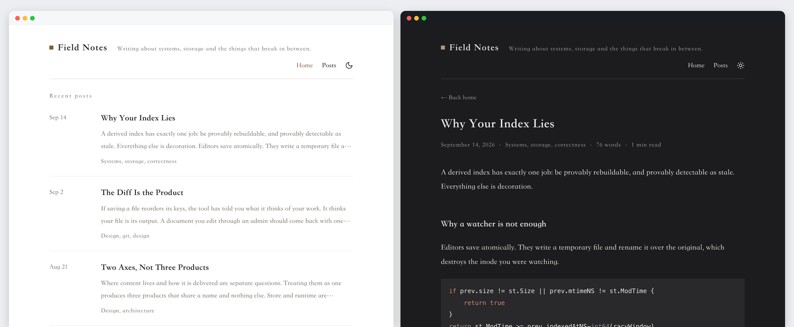

<p align="center">
  
</p>

<h1 align="center">Kite</h1>

<p align="center">
  <strong>A modern open-source publishing platform.</strong><br>
  One Content, Multiple Destinations.
</p>

<p align="center">
  <a href="https://github.com/kite-plus/kite/actions/workflows/ci.yml"></a>
  <a href="go.mod"></a>
  <a href="LICENSE"></a>
  <a href="docs/design/"></a>
</p>

<p align="center">
  English · <a href="README.zh-CN.md">简体中文</a>
</p>

---

Kite manages your content. Where it is deployed is a property of the content,
not a different product.

> **Status: early development.** Writing, the studio and Git publishing work
> end to end. Dynamic mode and plugins are not built yet — see
> [Roadmap](#roadmap).

<p align="center">
  
</p>

## Why

Publishing tools split into two camps, and picking one is hard to undo.

**Static site generators** give you Markdown, Git and cheap hosting, but no real
content management: you edit files, and there is no media library, no category
browser, no publish button.

**Content management systems** give you all of that, but they assume a server
and a database. Git, Markdown and static hosting fit awkwardly at best.

Kite refuses the choice. The same content, the same admin and the same themes
work whether a site is built into static files, served from a database, or
consumed through an API. Deployment becomes a setting rather than a migration.

## Try it

```bash
go install github.com/kite-plus/kite/cmd/kite@latest
```

```bash
kite init blog && cd blog
kite new post "Hello, Kite"
kite run
```

`kite init` asks what the site is called, where it will live, what language it
is written in, and whether to set a password and start a repository. Every
answer has a flag, and `kite init --yes` takes the defaults without asking, so
the same command works in a script with no terminal.

`kite run` serves the site, opens it, and reloads on every save. The studio is
at `/admin/`. When you want files instead of a server:

```bash
kite build
```

That produces a complete site in `public/`: pages, listings, pagination,
taxonomy and term pages, a 404, `sitemap.xml` and `rss.xml`.

Already have content written for another generator? Point Kite at it.

```bash
kite doctor --fix-ids   # adopt files that have no id yet
kite build --verify     # build twice, compare every byte
```

`draft: true`, `date`, `lastmod`, `tags` and `categories` are understood as they
are; nothing needs rewriting first.

### Commands

| | |
|---|---|
| `kite init [dir]` | create a project, asking what it should be |
| `kite new <kind> <title>` | create content |
| `kite build` | render the site into `public/` |
| `kite run` | serve the site with the studio, open it, reload on every save |
| `kite serve` | serve the site, rendering each request from the files |
| `kite index` | refresh the derived index |
| `kite list` | query content from the index |
| `kite doctor` | check the project, and repair what is safe to repair |
| `kite publish` | commit content, and push it when asked to |
| `kite auth` | manage the account that guards the studio |
| `kite openapi` | print the API description |
| `kite version` | print the version, commit and build date |

Every command takes `--json`, so none of them have to be parsed as prose.

## The studio

`kite run` opens the studio at `/admin/`. It is a React application compiled
into the binary, so there is nothing to install and nothing to keep in sync
with the server.

| | |
|---|---|
| **Dashboard** | what is published, what is still a draft, what is uncommitted, and a publishing trend by month |
| **Content** | posts and pages, filtered and searched through the index rather than the filesystem |
| **Editor** | Markdown with a live preview, front matter as a form, terms, slug, word count, and files dropped straight into the bundle |
| **Taxonomies** | tags and categories as they actually exist across the content |
| **Theme** | the settings the active theme declares in its `theme.yaml`, rendered as a form |
| **Settings** | title, description, base URL and language |

An item that changed on disk since it was loaded is refused rather than
overwritten, and the studio says so. Editing is available in English and
简体中文, chosen from the browser.

### Signing in

On localhost a project with no password is open, because there is nobody else
on the machine to keep out. Anywhere else the studio needs an account, and a
server that would put an unguarded one on a reachable address does not come up
open.

It comes up in **setup** instead. Nothing but the installer answers — not the
content, not the settings, not even the site's own title — and the installer
will not act without a token printed on the console that started the server.
Whoever started it is the only person who can finish it, which is what makes
starting one on a machine with a public address safe.

```bash
kite serve --admin --write --addr 0.0.0.0:1717
```
```
  Finish installing this site in a browser:

    http://localhost:1717/admin/setup
    setup token: 4regvbotpo4ov642v23eab2hhc2otkft
```

Set `KITE_SETUP_TOKEN` to choose that token yourself. To skip setup entirely,
give the server an account before it starts:

```bash
kite auth set-password                          # asked for twice, never echoed
```

`kite auth status` reports whether a project asks for a password, and
`kite auth remove` takes the account away again.

The account is stored in `.kite/secrets/account.json` as an argon2id hash. It
is never committed, and it has to survive a deployment for the account to. A
container can supply one from the environment instead — `KITE_ADMIN_USER` with
`KITE_ADMIN_PASSWORD`, or `KITE_ADMIN_PASSWORD_HASH` to keep a plaintext
password out of the process list — and the environment wins over the file.

### The API

Everything the studio does, it does over one HTTP API under `/api/v1`, which
the binary describes itself:

```bash
kite openapi > openapi.json
```

`--admin` serves it and `--write` allows it to change the project; without
`--write` the same API is read-only. The studio's typed client is generated
from that description and checked in CI, so the types it compiles against
cannot describe an API the server does not serve.

## Themes

Kite ships with one theme, compiled into the binary: quiet serif typography for
personal writing, light and dark, and no web fonts unless you ask for them, so
a page asks nothing of a third party.

A theme declares its own settings in `theme.yaml`, and the studio renders them
as a form — an option is a declaration rather than a documentation problem.
Templates live under `layouts/` in a theme and in a site alike, and the same
relative path in the site wins, so a single template can be replaced without
forking the theme.

The theme contract is not frozen yet; it freezes at M5, after a second theme
has been written against it.

## Configuration

`kite.yaml` sits at the root of a project. Everything except `site` is
optional, and the values below are the defaults.

```yaml
site:
  title: My Site
  baseURL: https://example.com
  language: en

content:
  store: file          # where content lives
  dir: content

theme:
  name: default
  settings:            # whatever the theme declares in theme.yaml
    accent: "#7d5c3c"

markdown:
  highlightTheme: github

build:
  output: public
  urlStyle: directory  # or extension, for /posts/hello.html
  pageSize: 10
  sitemap: true
  feed: true
  feedLimit: 20

publish:
  publisher: git
  branch: main
```

A few keys can be overridden from the environment, for a build whose output
depends on where it runs: `KITE_SITE_TITLE`, `KITE_SITE_BASEURL`,
`KITE_SITE_LANGUAGE`, `KITE_THEME`, `KITE_BUILD_OUTPUT`,
`KITE_BUILD_URLSTYLE` and `KITE_BUILD_PAGESIZE`.

## Deploying

`kite init` writes a GitHub Pages workflow that builds with `--verify`, so a
site that would deploy differently on a second run fails before it is
published. Turn Pages on under **Settings → Pages → Source → GitHub Actions**
and a push to `main` deploys.

Publishing from a machine instead goes through Git:

```bash
kite publish content/posts/hello --push
```

It commits exactly the paths given and nothing else: what you have staged stays
staged, and every other change stays where it is. `--all` publishes everything
uncommitted that Kite manages, and `--dry-run` reports what would happen and
stops.

## Design

Three decisions shape everything else.

**Markdown files are the source of truth.** In static mode nothing is stored in
a database that is not derived from the files. The index under `.kite/` is a
cache: delete it, rebuild, and the same rows come back.

**Your files are edited, not rewritten.** Saving a document rewrites only the
keys that changed. Key order, comments and flow-style lists survive untouched,
so changing a title produces a one-line diff.

**Store and runtime are independent.** Where content lives and how it is
delivered are separate choices, and every combination of them is legal.

The full reasoning, including the parts deliberately left unbuilt, is in
[docs/design](docs/design/).

| Document | Contents |
|---|---|
| [architecture.md](docs/design/architecture.md) | Content model, storage, build engine, publisher, roadmap |
| [theme-system.md](docs/design/theme-system.md) | Template lookup, data contract, `theme.yaml` |
| [plugin-system.md](docs/design/plugin-system.md) | WebAssembly runtime, host ABI, capabilities |

> The design documents are written in Chinese; terms of art stay in English.

## Build from source

Go 1.26 or newer:

```bash
make build      # ./bin/kite
make check      # format, vet, layering rules, tidiness, linter, tests
make web        # the admin, which is embedded into the binary
make web-gen    # regenerate the API client from this build's own description
```

`make web` needs Node and pnpm, both pinned exactly — the versions live in
`web/.nvmrc` and `web/package.json`. The rest of the build needs neither. A
binary built without it works and says the admin is missing rather than failing
to link.

The binary is self-contained. The default theme and the SQLite driver are
compiled in, nothing needs cgo, and every release target cross-compiles from any
host.

## Releases

Release binaries are reproducible: a given commit, built with the toolchain
pinned in `go.mod`, compiles to the same bytes anywhere.

```bash
GOTOOLCHAIN=$(awk '/^toolchain /{print $2}' go.mod) goreleaser build --snapshot --clean
```

Verify a download against the `checksums.txt` published with the release.

## Roadmap

| Milestone | Delivers | |
|---|---|---|
| M0 | `kite build`: content model, index, markdown, themes, static output | done |
| M1 | `kite serve`: render per request, watch and reload | done |
| M2 | Read-only admin over an existing repository | done |
| M3 | Editing admin: editor, media, conflict handling | done |
| M4 | Git publisher — **v1.0** | done |
| M5 | Public theme contract | |
| M6 | `kite.lock` and the `kitew` wrapper | |
| M7 | Dynamic mode backed by SQLite | |
| M8 | WebAssembly plugins | |

## Contributing

The layering rule in `scripts/check-imports.sh` is enforced in CI: the domain
core may not import storage, rendering or runtime packages. Commits follow
[Conventional Commits](https://www.conventionalcommits.org/en/v1.0.0/).

Before opening a pull request:

```bash
make check
```

If you touched the admin, `make web-check` type checks it and `make web` builds
the bundle CI compares against.

## License

[Apache License 2.0](LICENSE).
