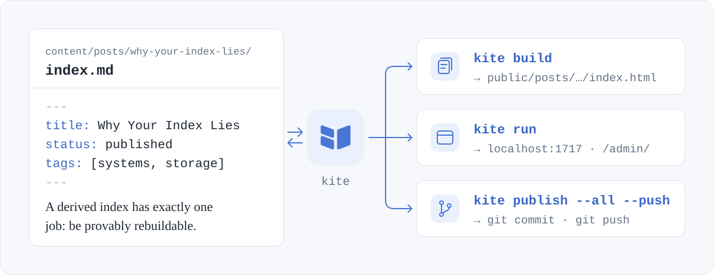

<p align="center">
  
</p>

<h1 align="center">Kite</h1>

<p align="center">
  Write in Markdown. Manage content in your browser. Publish on your terms.
</p>

<p align="center">
  <a href="https://www.kite.plus">Website</a> ·
  English · <a href="README.zh-CN.md">简体中文</a>
</p>

<p align="center">
  
</p>

Kite is an open-source publishing platform that gives you the writing experience of a CMS and the portability of a static site generator. It is a single Go binary with the admin studio built in.

- **A studio in your browser.** A visual editor that reads and writes Markdown, with the source one click away, image uploads, tags, categories, and drafts.
- **Files that stay yours.** Content is plain Markdown on disk. Saving rewrites only what changed and keeps your key order and comments, so editing a title is a one-line `git diff`.
- **Publish your way.** Export static pages for any host, run the site on your own server, or commit and push through Git.
- **Nothing else to install.** The studio, a default theme with light and dark modes, and the SQLite driver are compiled into the binary.
- **Plugins when you want them.** Comments, analytics, search, and math come as official plugins you install and switch on in the studio. A plugin adds code to pages, or runs WebAssembly in a sandbox while the site builds.

> Kite is in early development. Install from source using the steps below, which include the full studio.

## How it works

<p align="center">
  
</p>

Your Markdown files are the source of truth. The studio edits them in place, and the index Kite keeps under `.kite/` is only a cache: delete it, rebuild, and the same data comes back. The same files become static pages with `kite build`, a live site with `kite run`, or a Git commit with `kite publish`.

## Install and start

### Docker (recommended)

With Git and Docker installed, run:

```bash
git clone https://github.com/kite-plus/kite.git
cd kite
docker build -t kite .
docker run -d --name kite --restart unless-stopped -p 127.0.0.1:1717:1717 -v kite-data:/data kite
```

Open the [studio](http://localhost:1717/admin/) and follow the setup steps to name your site and create an admin account. Your site is at [localhost:1717](http://localhost:1717). The first build downloads dependencies and may take a while.

Content and your account are stored in the `kite-data` volume. To stop or restart:

```bash
docker stop kite
docker start kite
```

<details>
<summary>Without Docker: install locally</summary>

Requires Git, Make, Go 1.26.4+, Node.js 22.19.0, and pnpm 10.11.1. The build uses the Go toolchain pinned by the project.

```bash
git clone https://github.com/kite-plus/kite.git
cd kite
make web
make install
```

Add Go's binary installation directory (usually `~/go/bin`) to your `PATH`, then start a site in an empty folder:

```bash
mkdir blog
cd blog
kite run
```

The browser opens on a page that asks what the site is called; answer it and you are in the [studio](http://localhost:1717/admin/). `kite init` asks the same questions in the terminal instead. Next time, run `kite run` from the `blog` directory.

</details>

## Write and manage

1. Create a post or page in the studio. Write in the visual editor or switch to Markdown source.
2. Drop in images and set categories, tags, and a URL slug. Keep unfinished work as a draft; clear the draft setting and save when ready.
3. Update your site's name, URL, and language in Settings, and customize its appearance in Theme.

Local `kite run` includes drafts for preview. Normal serving and static builds exclude them.

## Publish your site

**Export static pages:** Open Deploy in the studio and export the site as a zip, then upload what is in it to any static host. From the command line, `kite build` writes the same files to `public/`. With Docker:

```bash
docker exec kite kite build
docker cp kite:/data/public ./public
```

**Run on a server:** Follow the [deployment guide](docs/reference.md#deploying) to configure your site domain and serve it over HTTPS.

**Publish through Git:** With a Git remote configured for your local site, run `kite publish --all --push` to commit and push content. Automatic deployment also needs a hosting workflow.

## Roadmap

- **Done:** static builds, live serving, the browser studio, and Git publishing (M0–M4), and the first version of WebAssembly plugins (M8). A few items remain before v1.0 is tagged.
- **Next:** a public theme contract, `kite.lock` with the `kitew` wrapper, and a dynamic mode backed by SQLite (M5–M7).

The [reference guide](docs/reference.md#roadmap) lists every milestone, and the [roadmap](docs/design/roadmap.md) tracks progress item by item.

## Contributing

- **Report a bug or share an idea:** [open an issue](https://github.com/kite-plus/kite/issues) with your version, environment, and steps to reproduce.
- **Send a change:** read the [contributing notes](docs/reference.md#contributing) and run `make check` before you open a pull request. If a change conflicts with the [design documents](docs/design/), update the documents first.

## More

- [Reference guide](docs/reference.md): accounts, themes, plugins, configuration, deployment, and development.
- [Design documents](docs/design/): architecture, the theme system, and the plugin system, written in Chinese.
- [Apache License 2.0](LICENSE)
